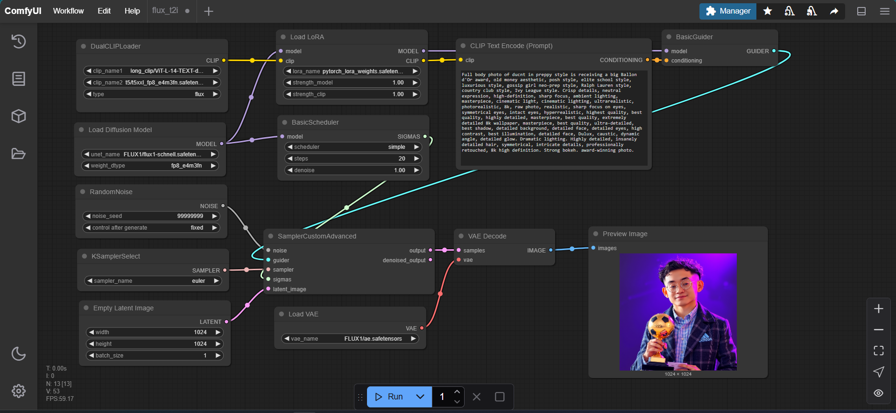
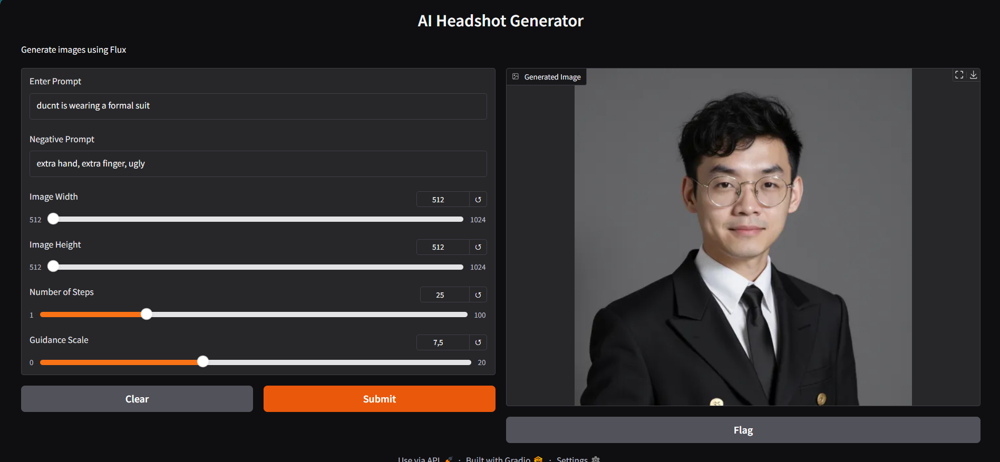

# SimpleTuner LoRA Trainer + Gradio Inference 💡

> ⚠️ **Warning**: Training scripts can potentially overwrite or damage your data. Always back up your datasets and models before starting.

This project uses **SimpleTuner** to train **LoRA (Low-Rank Adaptation)** models and includes a **Gradio-based web interface** for running inference with the trained models.

---

## 📌 Project Highlights

- **LoRA Training Made Simple**: Easily train LoRA models on supported base models using SimpleTuner.
- **Gradio UI**: Quickly test your trained model with a simple drag-and-drop interface.
- **Multi-GPU & Memory Efficient**: Train on a wide range of hardware, from consumer GPUs to powerful multi-GPU setups.
- **Aspect Ratio Bucketing**: Train with images of various sizes while preserving quality.
- **Low VRAM Modes**: Supports 16G GPUs or even less using quantized training (NF4, INT8, FP8).

---

## 🔧 Features

- LoRA and full fine-tuning support
- Compatible with SDXL, SD 2.x, SD 3.0, PixArt Sigma, Flux.1, and more
- Quantised training options for low VRAM usage
- Exponential Moving Average (EMA) to stabilize training
- Webhook & Hugging Face Hub integration
- Can train from S3-compatible storage like R2 or Wasabi

---

## 🖥 Hardware Requirements

| GPU Type     | Minimum VRAM | Notes                                      |
|--------------|--------------|--------------------------------------------|
| NVIDIA       | 16 GB        | Full support with memory-efficient attention |
| AMD          | 24 GB        | Verified on 7900 XTX, higher RAM usage     |
| Apple M-series | 24 GB     | Works with M3 Max, slower training speeds   |

---
## 📸 Workflow 

I use ComfyUI to create the workflow of my inference


---
## 🚀 Start

### 1. Setup Environment and Install all required library
```bash
git clone https://github.com/tuanduc8t1/AI-Headshot.git
cd SimpleTuner
conda create -n simpletuner python=3.10 -y
conda activate simpletuner
pip install -r requirements.txt
```
Read QUICKSTART.md for more infomations

### 2. Train a LoRA Model
```bash
python configure.py
# Setting parameters. Read OPTIONS.md for more infomations 
sh train.sh
```
Read QUICKSTART.md for more informations

### 3. Run Inference with Gradio
```bash
python test_result.py
```
This will launch a web interface where you can generate images using your trained LoRA model




---

## 🛠 Troubleshooting

Enable detailed logs:

```bash
export SIMPLETUNER_LOG_LEVEL=DEBUG
```

If training crashes, lower resolution or batch size, or try using quantized options like:

```bash
--base_model_precision int8-quanto
```

---

## 🤝 Contributing

This is an educational and experimental project. Contributions and pull requests are welcome!

---

## 📢 License

GNU Affero General Public License v3.0
